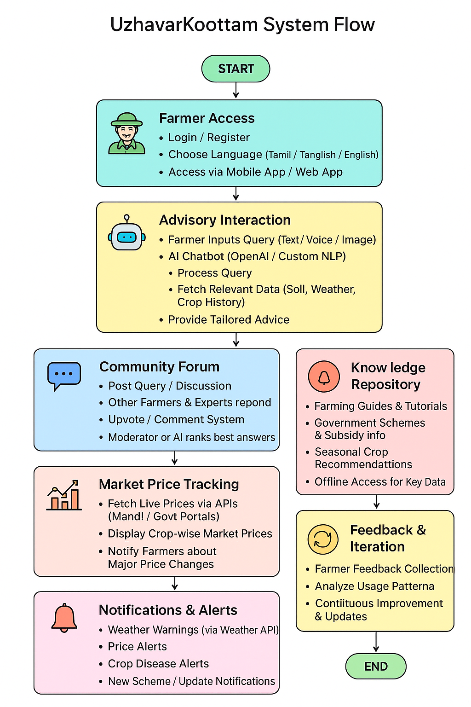

# Smart India Hackathon Workshop
# Date:
## Register Number:
## Name:
## Problem Title
SIH 25010: Smart Crop Advisory System for Small and Marginal Farmers
## Problem Description
A majority of small and marginal farmers in India rely on traditional knowledge, local shopkeepers, or guesswork for crop selection, pest control, and fertilizer use. They lack access to personalized, real-time advisory services that account for soil type, weather conditions, and crop history. This often leads to poor yield, excessive input costs, and environmental degradation due to overuse of chemicals. Language barriers, low digital literacy, and absence of localized tools further limit their access to modern agri-tech resources.

Impact / Why this problem needs to be solved

Helping small farmers make informed decisions can significantly increase productivity, reduce costs, and improve livelihoods. It also contributes to sustainable farming practices, food security, and environmental conservation. A smart advisory solution can empower farmers with scientific insights in their native language and reduce dependency on unreliable third-party advice.

Expected Outcomes

• A multilingual, AI-based mobile app or chatbot that provides real-time, location-specific crop advisory.
• Soil health recommendations and fertilizer guidance.
• Weather-based alerts and predictive insights.
• Pest/disease detection via image uploads.
• Market price tracking.
• Voice support for low-literate users.
• Feedback and usage data collection for continuous improvement.

Relevant Stakeholders / Beneficiaries

• Small and marginal farmers
• Agricultural extension officers
• Government agriculture departments
• NGOs and cooperatives
• Agri-tech startups

Supporting Data

• 86% of Indian farmers are small or marginal (NABARD Report, 2022).
• Studies show ICT-based advisories can increase crop yield by 20–30%.

## Problem Creater's Organization
Government of Punjab

## Theme
Agriculture, FoodTech & Rural Development

## Proposed Solution
```
⦁	Instant Advice: Farmers get quick, local guidance without waiting for expert visits. 
⦁	Price Awareness: Real-time price updates help farmers avoid middlemen and sell at better rates. 
⦁	Community Support: Farmers connect and share knowledge in one trusted space. 
⦁	Easy Access: Voice and offline features ensure usability for all farmers. 
⦁	One Platform: Combines advice, community, and market tools, replacing scattered services.

⦁	Innovation and Uniqueness Culturally Rooted: Inspired by Tamil traditions (Kalappai and  Kootam) for community and sharing.
⦁	Localized AI: Supports Tamil language and regional farming needs. 
⦁	Digital Village: A community that replicates traditional gatherings online.
⦁	Market Intelligence: Real-time price tracking in one platform. 
⦁	Inclusive Access: Works with voice and offline mode for farmers with low digital skills. 
⦁	Integrated Solution: Combines advisory, community, and market features in one app,       unlike existing fragmented tools.
```

## Technical Approach
```
⦁	Technologies to Be Used Programming Languages Frontend: JavaScript (React.js for web, React Native for mobile) Backend: Python (Django or Flask) AI Engine: Python (TensorFlow / PyTorch / OpenAI(chatgpt) AP) Database: PostgreSQL or MongoDB or MariaDB
⦁	Frameworks & Tools Mobile App Development: React Native (cross-platform support for Android and iOS) Web App Development: React.js with Material UI / Tailwind CSS for design AI/NLP            Chatbot: OpenAI GPT API or custom-trained NLP model

⦁	APIs: Weather API (IMD or Weatherstack) Government agriculture data APIs Market price APIs (from mandi portals) Cloud & Hosting: AWS / Google Cloud / Azure Version Control: Git + GitHub / GitLab Push Notifications: Firebase Cloud Messaging

⦁	Hardware: Mobile phones (Android smartphones for farmers) Servers for backend processing (Cloud-based hosting) Optional IoT sensors in later phases for soil & crop monitoring

Methodology and Process for Implementation:
⦁	Phase 1 — Requirement Analysis Understand farmer needs through surveys and interviews. Define functional requirements (chatbot, community forum, price tracker).

⦁	Phase 2 — Design UI/UX design for mobile and web app. System architecture design (backend, frontend, APIs).

⦁	Phase 3 — Development Frontend: Build mobile and web interfaces. Backend: Develop APIs, database structure, AI integration. AI Chatbot: Train or configure chatbot for Tamil and English and social media based languages queries. Market Price Integration: Connect APIs for live prices.

⦁	Phase 4 — Testing Unit testing, integration testing, user testing with farmers. Ensure offline and voice access work well.

⦁	Phase 5 — Deployment Deploy on cloud hosting platforms. Publish mobile app on Google Play Store (and optionally Apple App Store).

⦁	Phase 6 — Feedback & Iteration Collect farmer feedback. Improve system based on real-world usage.

System Flow (Simplified) Here’s a working process flow for UzhavarKootam: User Access → Farmer logs in via mobile app / web app. Advisory Interaction → Farmer asks a question → AI chatbot processes query → Provides tailored advice. Community Forum → Farmer posts query/discussion → Other farmers or experts respond → Best answers are upvoted. Market Price Tracking → System fetches live price data via API → Displays prices for relevant crops & markets. Knowledge Repository → Farmer accesses guides, tutorials, government scheme updates. Notifications → System sends alerts for price changes, weather warnings, or seasonal advice.
```


## Feasibility and Viability
```
⦁	Feasibility (Can it be done?) Technology: Do we have the tools and skills to make it? Operations: Will it work smoothly with current systems? Cost: Do we have enough budget? Will it be worth it?

⦁	Viability (Will it last?) Demand: Will people want it? Profit: Can it make money? Growth: Can it grow without big extra costs? Rules: Will it follow laws and regulations?

⦁	Challenges & Risks Technical problems Low demand Lack of funds Strong competitors Legal issues

⦁	How to Overcome Challenges Build a small version first and improve it Get feedback from users Find investors or funding Offer something unique Follow rules and consult experts
```
## Impact and Benefits
```
⦁	Benefits (What good it brings) Saves time and effort Reduces costs Improves quality or efficiency Makes life easier for users Creates new opportunities

⦁	Impact (The bigger effect) Helps the community or industry grow Creates jobs or income Improves standards or processes Encourages innovation Supports long-term growth
```
## Research and References
```
⦁	📚 Official Sources Agricultural Marketing Department – Uzhavar Sandhai Details Provides comprehensive information on the Uzhavar Sandhai scheme, including its objectives and operational details. 👉 agrimark.tn.gov.in

⦁	Chief Minister's Uzhavar Pathukappu Thittam (CMUPT) Details the welfare schemes under CMUPT aimed at supporting farmers and agricultural laborers. 👉 oap.tn.gov.in

⦁	Uzhavar Sandhai Pvt Ltd A private initiative supporting small and marginal farmers in Tamil Nadu, focusing on sustainable agribusiness practices. 👉 uzhavarsandhai.in

⦁	📰 News Articles "Uzhavar Sandhai vegetables at your doorstep in Tamil Nadu" Discusses the integration of Uzhavar Sandhais with local online sales platforms to deliver fresh produce to consumers. 👉 newindianexpress.com

⦁	"25 years on, has state's farmers' market gone stale?" Analyzes the evolution and challenges faced by Uzhavar Sandhais over the years. 👉 timesofindia.indiatimes.com

⦁	📊 Research Papers "Uzhavar Sandhai in Tamil Nadu: Is empowering rural farmers a success?" A study examining the impact of Uzhavar Sandhais on rural farmers and their empowerment. 👉 questjournals.org

⦁	"Chief Minister's Uzhavar Pathukappu Thittam - A Need for its Revival" Discusses the significance of the CMUPT scheme and its impact on agricultural laborers. 👉 ijfmr.com

⦁	🖼️ Visual Resources Uzhavar Sandhai – Wikipedia Provides an overview of the Uzhavar Sandhai initiative, including its history and objectives. 👉 en.wikipedia.org

⦁	Uzhavar Sandhai – Facebook Page Official Facebook page featuring updates and information on Uzhavar Sandhais across Tamil Nadu. 👉 facebook.com
```